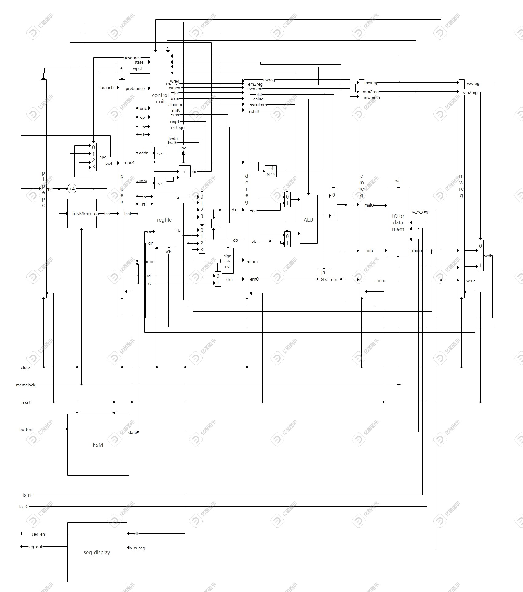

# Pipelined CPU implemented by Verilog

More details, please check `report.pdf`

## 开发者说明

12110916 李浩宇，负责状态控制、IO、asm，贡献比$33\%$
12112609 刘一郴，负责pipeline CPU模块设计，hazard解决方案，贡献比$33\%$
12110924 田若载，负责Uart通信、memory管理、ALU等基础模块，贡献比$33\%$

## CPU架构设计说明
### CPU特性
**ISA**
**寻址空间设计**
属于哈佛结构
寻址单位：1byte
指令空间、数据空间大小均为64KB
**对外设IO的支持**
采用MMIO，拨码开关对应的地址是0x00000000,0x00000004,0x00000008
LED对应的地址是0x0000000C
数码管对应的地址是0x0000010
采用中断的方式访问IO
**CPU的CPI**
不考虑hazard的情况下CPU的CPI为1。
对于data hazard, 只有lw引起的hazard会多产生一个cycle的花费。
对于branch hazard， 只有发生跳转会多产生一个cycle的花费。
该CPU为多周期pipelineCPU，采用经典5级流水（IF, ID, EXE, MEM, WB）。

### CPU接口
**时钟信号**
`clk`：Minisys内置时钟信号 (PIN Y18)
**复位信号**
`reset`: 按钮，按下时重置CPU至初始状态 (PIN P20)
**uart接口**
`start_pg`: 开关，打开时设置CPU为Uart通信模式，关闭时设置CPU为工作模式 (PIN AA6)
`rx`: Uart输入  (PIN Y19)
`tx`: Uart输出 (PIN V18)
**按钮**
控制I/O和CPU状态的切换(PIN P4)
**拨码开关**
用于输入数据(PIN Y9,W9,Y7,U6,W5,W6,U5,T5,T4,R4,W4)

### CPU内部结构
#### CPU内部各子模块的接口连接关系图

## 
### 视频
见链接 https://www.bilibili.com/video/BV1qP411D7Cc/

## 测试说明
**测试方法：** 仿真
**测试类型：** 集成
**测试用例及结果：**
通过lab课件的方法测出这个pipeline cpu的周期大概是单周期cpu的四分之一。
通过仿真测出pipeline cpu在测试场景1 3'b000测试用例中花费了46个周期，单周期cpu花了42个周期。（见视频）
所以speedup大概是$\frac{42*4}{46}=3.65$

## 问题及总结
设计了一个pipeline cpu并进行了测试，通过了基础测试场景，并对效率进行测试，发现相比单周期CPU显著地提升了效率。
